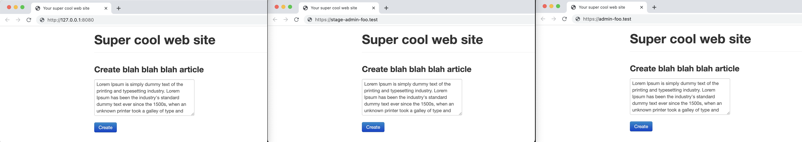
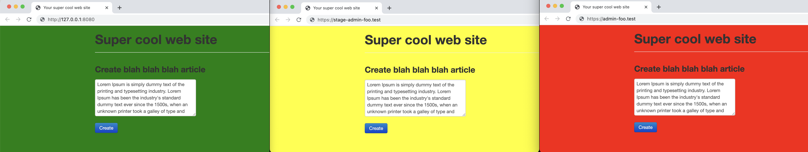

# Peacekeeper
- Peacekeeper will notify you for each website you specify.
- TODO: link to chrome web store

## Screenshot
### Before
- Which one is LOCALHOST? You will have an accident someday.


### After
- It's sooooo peaceful.


## Configs
### url (required)
- Specify target URL with regular expression
```json
"url": "https://.*stage-admin.+"
```
### alert
- Run JavaScript `alert("blah blah blah")`
```json
"alert": "blah blah blah",
```
- Disable alert
```json
"alert": false,
```
### favicon
- Change the favicon
```json
"favicon": {
  "href": "URL or Data URI",
  "rel": "shortcut icon",
  "type": "image/x-icon"
},
```
- Disable to change the favicon
```json
"favicon": false,
```
### style
- Change style `backgroundColor`
```json
"style": {
  "backgroundColor": "yellow"
},
```
- Disable to change style
```json
"style": false,
```
### toast
- Show popup box via [`sweetalert2`](https://github.com/sweetalert2/sweetalert2)
```json
"toast": {
  "icon": "error",
  "position": "center",
  "showConfirmButton": false,
  "timer": 1000,
  "title": "Hey, Watch out! It's PRODUCTION!!!"
},
```
- Disable to show popup box
```json
"toast": false,
```
